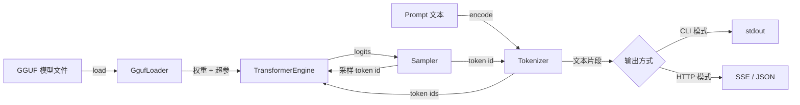

# 技术方案设计

## 澄清溯源

> 澄清过程详见：`clarifications.draft.md`

## 非当前仓库依赖

- <依赖>：Catch2 - 仅测试依赖（FetchContent 拉取，v3.x），运行时零第三方依赖

## 改动概览

### 改动目录树

```
cllm_inference/
├── CMakeLists.txt                    (修改) - 源文件清单、include 目录、Catch2 FetchContent、可执行目标
├── include/cllm/
│   ├── core/
│   │   ├── gguf.hpp                  (新增) - GGUF 解析器接口 + 元数据结构
│   │   ├── tensor.hpp                (新增) - 张量定义与内存视图
│   │   ├── quant.hpp                 (新增) - 量化类型枚举 + 反量化内核接口
│   │   ├── engine.hpp                (新增) - 通用 Transformer 引擎接口
│   │   ├── tokenizer.hpp             (新增) - Tokenizer 接口
│   │   ├── sampler.hpp               (新增) - 采样器接口
│   │   └── thread_pool.hpp           (新增) - 线程池接口
│   └── server/
│       └── http_server.hpp           (新增) - HTTP 服务器接口
├── src/
│   ├── core/
│   │   ├── gguf.cpp                  (新增) - GGUF 解析 + mmap 权重加载
│   │   ├── quant.cpp                 (新增) - 各量化类型反量化实现
│   │   ├── engine.cpp                (新增) - RMSNorm/RoPE/Attention/FFN/KV Cache
│   │   ├── tokenizer.cpp             (新增) - 编码/解码
│   │   ├── sampler.cpp               (新增) - greedy/temp/top-p/top-k
│   │   └── thread_pool.cpp           (新增) - std::thread 线程池
│   ├── server/
│   │   └── http_server.cpp           (新增) - socket + HTTP/1.1 + SSE
│   └── main.cpp                      (修改) - 替换为 CLI/服务入口
└── tests/
    ├── test_gguf.cpp                 (新增) - GGUF 解析测试
    ├── test_quant.cpp                (新增) - 反量化精度测试
    └── test_engine.cpp               (新增) - 前向推理数值测试
```

### 数据流转图



## 详细改动点

### D-1：[修改] 构建系统与目标组织

- **文件**：`CMakeLists.txt`
- **目的**：将单一 `main.cpp` 扩展为多模块库 + 可执行文件 + 测试目标
- **实现**：定义 `cllm_core`（内核静态库）、`cllm_inference`（可执行）、`cllm_tests`（测试）；`target_include_directories` 指向 `include/`；`FetchContent` 拉取 Catch2 仅用于测试；保持 C++20
- **代码**：
```cmake
add_library(cllm_core src/core/*.cpp src/server/http_server.cpp)
add_executable(cllm_inference src/main.cpp)
target_link_libraries(cllm_inference PRIVATE cllm_core)
```

### D-2：[新增] GGUF 解析器

- **文件**：`include/cllm/core/gguf.hpp` + `src/core/gguf.cpp`
- **目的**：解析 GGUF v2/v3 头部、metadata KV 字典与 tensor info 表
- **实现**：校验 `GGUF` magic 与 version；读取 tensor_count / kv_count；解析 KV（key + type + value，支持 STRING/数值/ARRAY 类型）；解析 tensor info（name、n_dims、dims、type、offset）；将架构相关超参抽取为 `ModelConfig` 结构
- **代码**：
```cpp
struct ModelConfig {
    std::string arch;
    uint32_t n_layers, n_embd, n_head, n_head_kv, n_ctx;
    uint32_t n_ff, vocab_size;
    float rope_theta, norm_eps;
};
class GgufLoader { static ModelConfig load(const std::string& path); };
```

### D-3：[新增] 张量定义与 mmap 加载

- **文件**：`include/cllm/core/tensor.hpp` + `src/core/gguf.cpp`
- **目的**：以 mmap 只读方式映射权重，避免全量拷贝，按需反量化
- **实现**：`Tensor` 保存 shape、ggml 类型、数据指针（指向 mmap 区域）与偏移；加载时 `mmap` 整个文件，张量按 offset 惰性引用；提供 `dequantize()` 统一输出 float 向量
- **代码**：
```cpp
struct Tensor {
    std::vector<uint32_t> shape;
    GgmlType type;
    const void* data;   // 指向 mmap 区域
    std::vector<float> dequantize() const;
};
```

### D-4：[新增] 量化反量化内核

- **文件**：`include/cllm/core/quant.hpp` + `src/core/quant.cpp`
- **目的**：实现 F32/F16/Q8_0/Q4_0/Q4_K 等类型的反量化，输出 float
- **实现**：按块格式（Q8_0/Q4_0 块大小 32，Q4_K 超块 256）还原；首版纯标量 C++，预留 `dequantize_block_<type>()` 函数指针接口以便后续 SIMD 替换；输出精度允许采样级误差
- **代码**：
```cpp
enum class GgmlType : uint32_t { F32=0, F16=1, Q4_0=2, Q4_1=3, Q5_0=6,
    Q5_1=7, Q8_0=8, Q8_1=9, Q2_K=10, Q3_K=11, Q4_K=12, Q5_K=13, Q6_K=14 };
void dequantize_block(const void* src, float* dst, GgmlType t, int64_t n);
```

### D-5：[新增] 线程池

- **文件**：`include/cllm/core/thread_pool.hpp` + `src/core/thread_pool.cpp`
- **目的**：提供多线程并行执行能力，供 matmul 等大张量运算使用
- **实现**：基于 `std::thread` + 任务队列（`std::condition_variable`）的手写线程池；支持 `parallel_for(begin, end, fn)` 分块并行；线程数可配置，默认取 `std::thread::hardware_concurrency()`
- **代码**：
```cpp
class ThreadPool {
public:
    explicit ThreadPool(size_t n);
    void parallel_for(size_t begin, size_t end,
                      const std::function<void(size_t, size_t)>& fn);
};
```

### D-6：[新增] 通用 Transformer 推理引擎

- **文件**：`include/cllm/core/engine.hpp` + `src/core/engine.cpp`
- **目的**：实现 metadata 驱动的通用 Transformer 前向（RMSNorm、RoPE、GQA Attention、SwiGLU FFN、KV Cache）
- **实现**：由 `ModelConfig` 参数化各层（层数、头数、GQA 分组、RoPE base 等）；单步 `forward(token)` 返回 logits 并更新 KV Cache；线性层 x·Wᵀ 经线程池分块并行，量化权重先反量化再乘（首版）；支持 Llama/Qwen/Mistral 同族架构
- **代码**：
```cpp
class TransformerEngine {
public:
    TransformerEngine(const ModelConfig& cfg, const Tensors& weights, ThreadPool& pool);
    std::vector<float> forward(int token);   // 更新 KV Cache，返回 logits
};
```

### D-7：[新增] Tokenizer

- **文件**：`include/cllm/core/tokenizer.hpp` + `src/core/tokenizer.cpp`
- **目的**：基于 GGUF 内置 vocab 实现文本编解码
- **实现**：从 metadata 读取 tokens/scores/token_type/bos/eos/merges；支持 SentencePiece（llama 类）与 BPE 两种合并方式（由 `tokenizer.ggml.model` 决定）；`encode` 含 BOS 处理，`decode` 按合并规则还原文本
- **代码**：
```cpp
class Tokenizer {
public:
    std::vector<int> encode(const std::string& text) const;
    std::string decode(int token) const;
    int bos_id, eos_id;
};
```

### D-8：[新增] 采样器

- **文件**：`include/cllm/core/sampler.hpp` + `src/core/sampler.cpp`
- **目的**：对 logits 施加温度并执行 greedy/top-p/top-k 采样
- **实现**：`sample(logits, params)` 内部先温度缩放 → softmax → top-k 过滤 → top-p（nucleus）过滤 → 按概率采样；`params` 含 temperature/top_p/top_k；temperature=0 时退化为 greedy
- **代码**：
```cpp
struct SampleParams { float temperature=0.8f, top_p=0.9f; int top_k=40; };
class Sampler { static int sample(const std::vector<float>& logits,
                                 const SampleParams& p, std::mt19937& rng); };
```

### D-9：[新增] HTTP 推理服务器（OpenAI 兼容 + SSE）

- **文件**：`include/cllm/server/http_server.hpp` + `src/server/http_server.cpp`
- **目的**：纯标准库自研 HTTP 服务，提供 OpenAI 兼容接口与 SSE 流式
- **实现**：`bind/listen/accept` + 每连接一线程（复用请求线程池）；手写 HTTP/1.1 请求解析与响应构建；路由 `/v1/completions`、`/v1/chat/completions`、`/health`；解析 JSON 请求体（messages/prompt/max_tokens/temperature/top_p/stream/stop）；`stream=true` 时以 `text/event-stream` 逐 token 推送 `data: {...}` 并最终 `data: [DONE]`；检测客户端断开以终止生成
- **代码**：
```cpp
class HttpServer {
public:
    HttpServer(TransformerEngine& eng, Tokenizer& tok, uint16_t port);
    void start();   // 阻塞监听循环
};
```

### D-10：[修改] CLI / 服务入口

- **文件**：`src/main.cpp`
- **目的**：提供本地推理与 HTTP 服务双入口
- **实现**：解析 `--model <path>`（必选）、`--prompt <text>`、`--port <n>`、`--threads <n>`、`--temperature/--top-p/--top-k/--max-tokens`；提供 `--prompt` 时走本地生成并流式输出到 stdout，否则启动 HTTP 服务；加载模型后打印基础信息（架构、参数量、量化类型）
- **代码**：
```cpp
int main(int argc, char** argv) {
    // 解析参数 → GgufLoader::load → 构建引擎/Tokenizer
    // --prompt 存在 ? 本地生成 : HttpServer.start()
}
```
